## Task Day-3


1. Create environment 

* pilih composer sesuai kebutuhan. Composer 1 menyediakan Airflow 1 & 2, sedangkan Composer 2 hanya Airflow 2 namun bisa Autoscaling.

* Disini saya menggunakan composer 2.

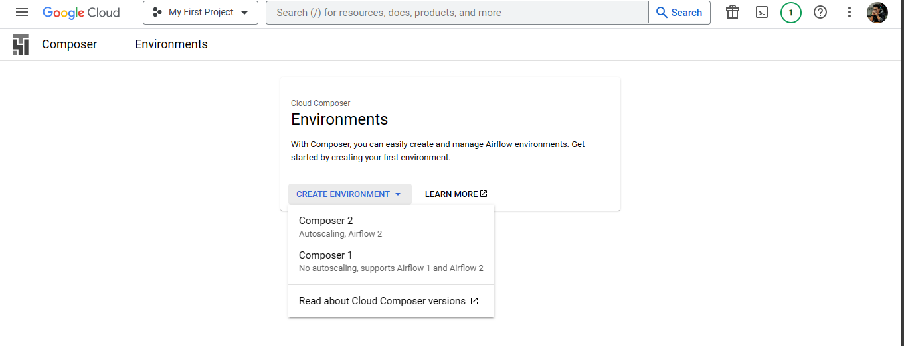

2. Kemudian Lakukan Configuration lalu Klik Create

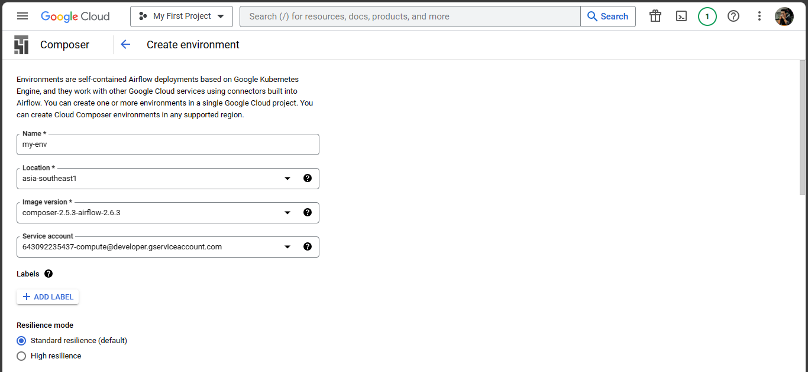


3. Tunggu hingga proses selesai

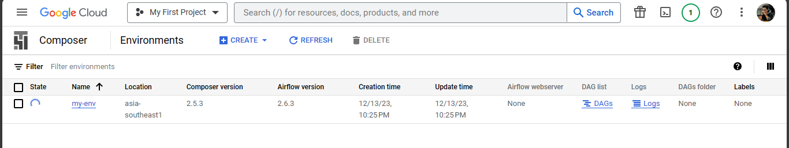

* Setelah proses selesai, environment berhasil dibuat

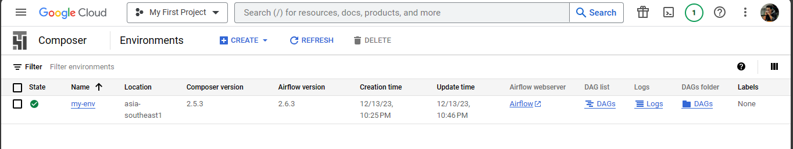

4. Upload DAG dengan menjalankan script berikut:
```
gcloud composer environments storage dags import \
    --environment my-environment \
    --location asia-southeast1 \
    --source="cloud-composer/insert.py"
```

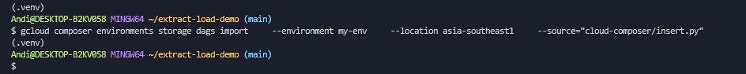

* DAG sudah diupload
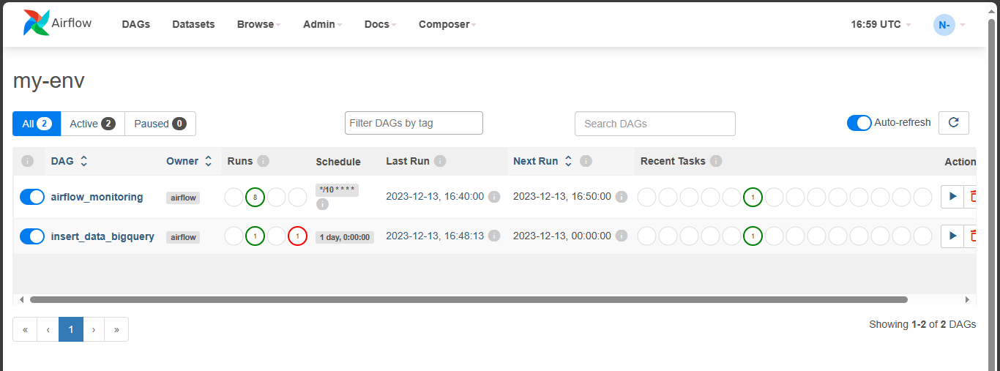

    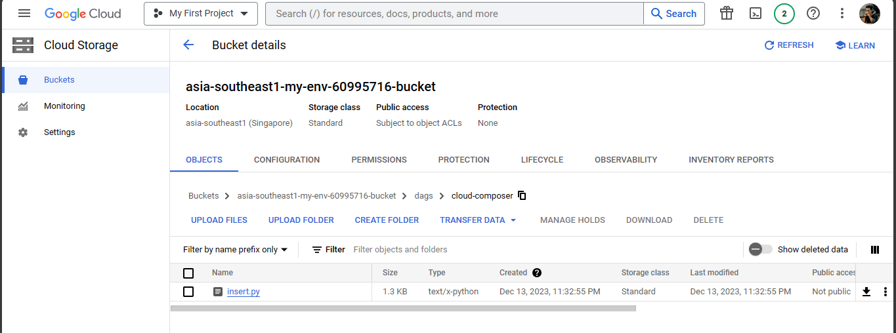

    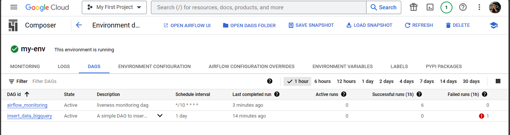


5. Pengecekan Data di BigQuery

Data sudah berhasil di insert ke my_table

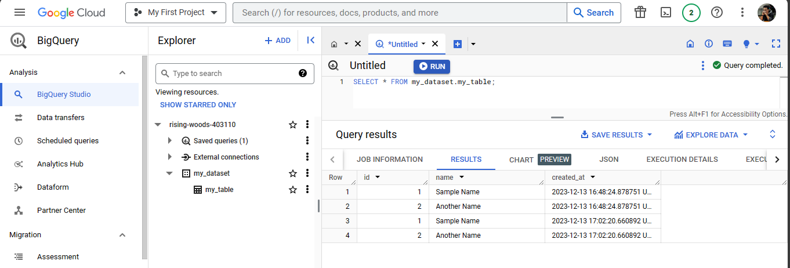

* DAG yang sudah berhasil diupload bisa ditrigger dan dipause secara manual di UI Airflow

    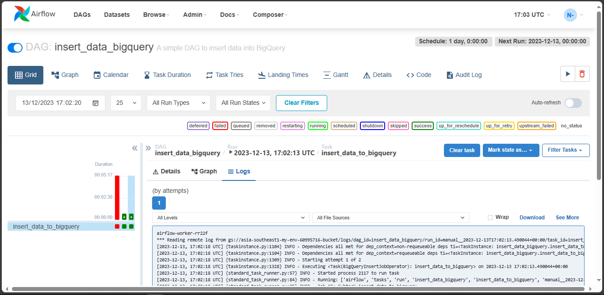


6. Delete DAG
```
gcloud composer environments storage dags delete \
    --environment my-environment \
    --location asia-southeast1 \
    cloud-composer/insert.py
```


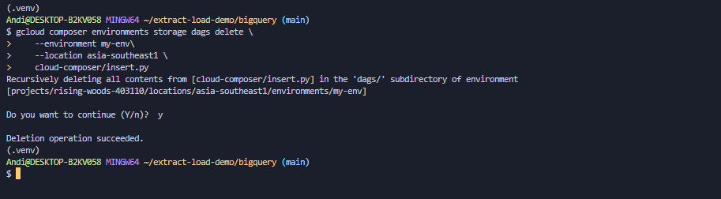

* DAG berhasil dihapus

    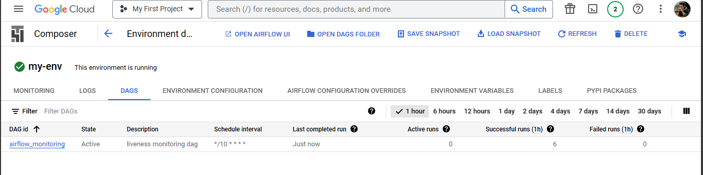

    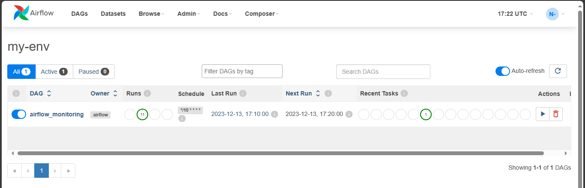
